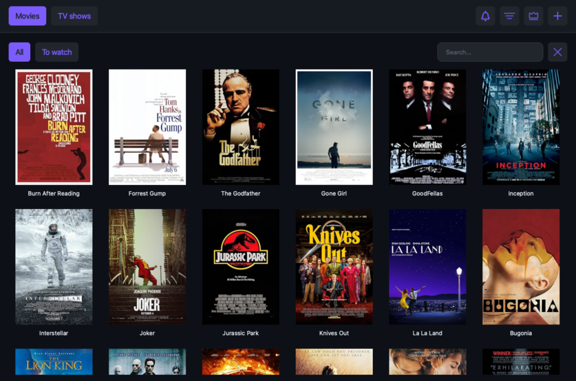

# MovieTracker

A desktop app to track your movies and TV shows. Built with C++ and Qt6.



---

## Features

- **Library** — Browse your movies and TV shows in a poster grid, sortable by title, release date, last viewed, or rank.
- **Search & add** — Search the OMDb database by title and add results to your library in one click.
- **Watched tracking** — Mark titles as watched or unwatched. Filter the library to show only titles left to watch.
- **Season updates** — On launch, the app checks OMDb for new seasons on your tracked TV shows (every 14 days). Shows with a new season are automatically reset to unwatched.
- **Tournament ranking** — *(coming soon)* Head-to-head tournament to rank every title in your library.

---

## Requirements

- Qt 6.x (Core, Gui, Widgets, Network, Concurrent, Svg)
- CMake 3.16+
- C++20 compiler (clang or gcc)
- An [OMDb API key](https://www.omdbapi.com/apikey.aspx) (free tier available)

---

## Build

For development, build and run directly:

```bash
cmake -B build
cmake --build build
cd build && ./MovieTracker
```

### Bundle (macOS .app)

To produce a standalone `.app` with Qt dependencies bundled in, use the provided script. `macdeployqt` must be in your PATH.

```bash
./scripts/bundle.sh "MovieTracker"
```

This builds the binary, creates the `.app` structure, generates the icon, copies assets, runs `macdeployqt`, and cleans up the build directory. The result is a `MovieTracker.app` ready to run.

---

## Setup

On first launch, go to **Omdb API key → Set API Key** in the menu bar and enter your OMDb key. Without it, search and season update checks will not work.

---

## Data storage

The app stores your library at:

```
~/.local/share/movieTracker/movieTracker.json
```

Poster images are saved alongside it in:

```
~/.local/share/movieTracker/Posters/
```

